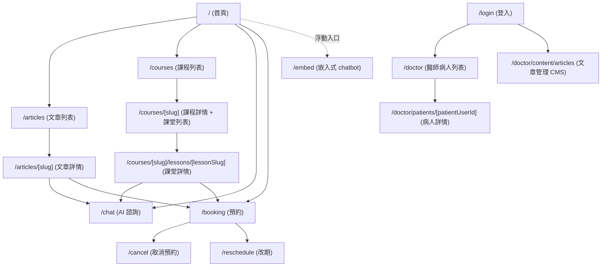
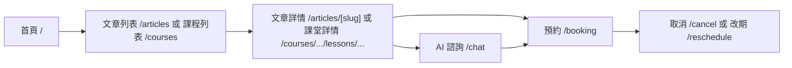
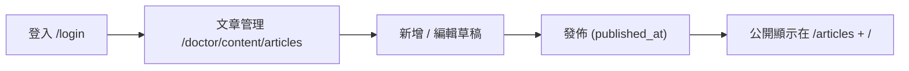
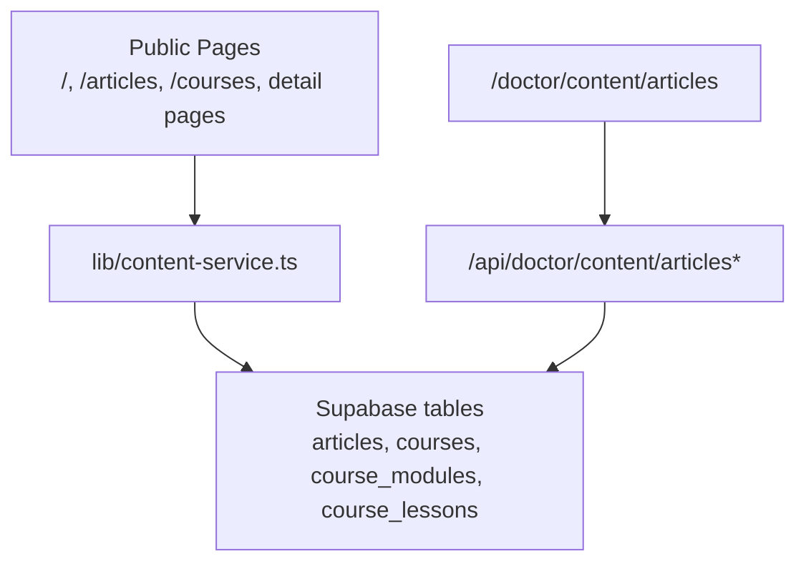
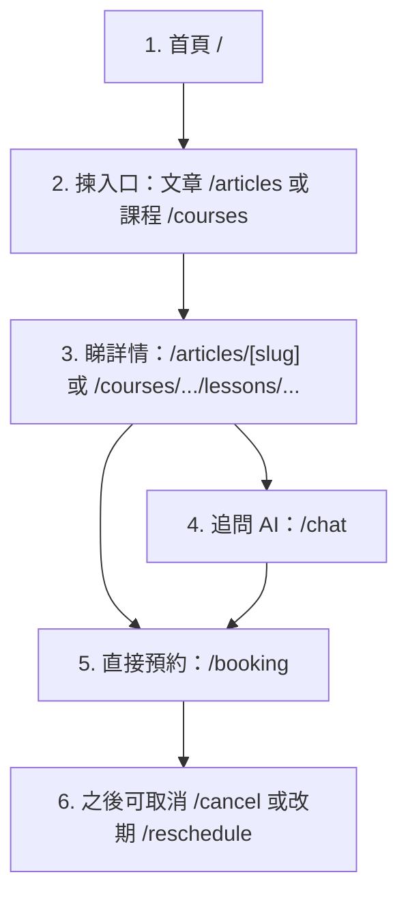
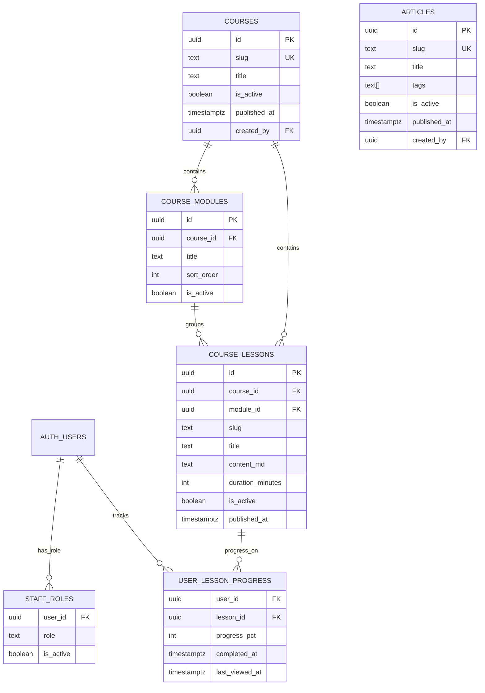
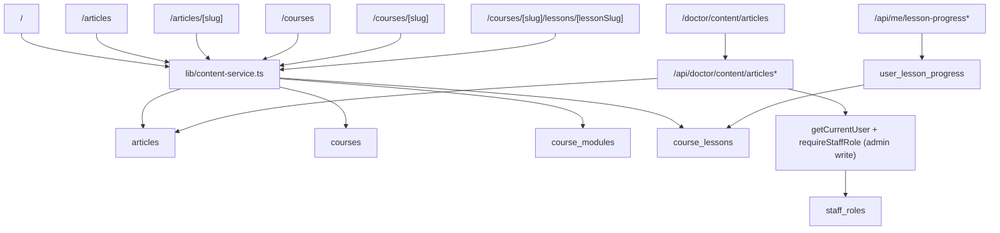
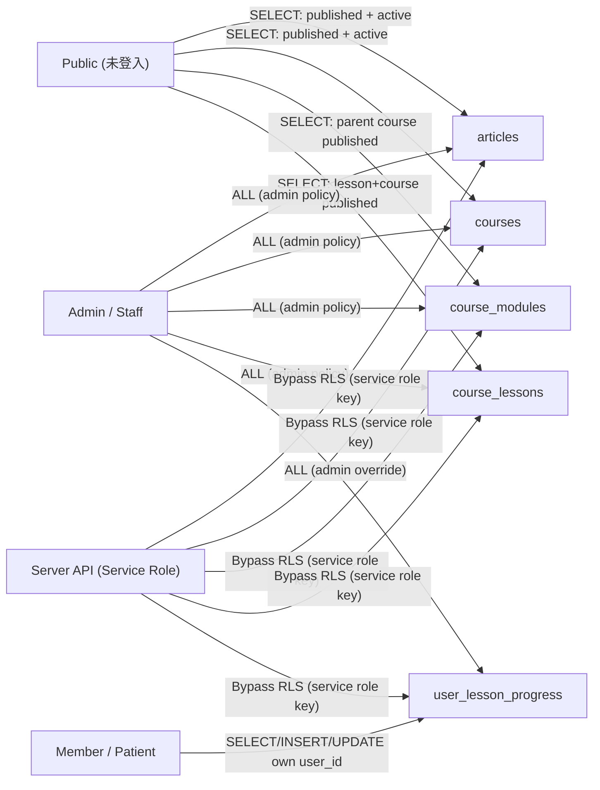

# EdenChatbotBooking Website Architecture Map

最後更新：2026-02-17

## 1) 全站頁面架構（Page to Page）

## 2) 用戶主流程（由內容去 AI / 預約）

## 3) 後台內容管理流程（你而家可直接出文）

## 4) 資料流（簡化）

## 5) 目前重點狀態

- 已合併成單一主站：`https://edenchatbot-booking.vercel.app`
- 已有文章後台 CMS：`/doctor/content/articles`
- 已支援中文 slug 文章路由（例如 `/articles/雨水`）

## 6) 純用戶視角（最簡版）

## 7) 資料表關係圖（ERD）

## 8) 頁面 → API/Service → Table 對應圖

## 9) RLS 權限邏輯（簡版）

