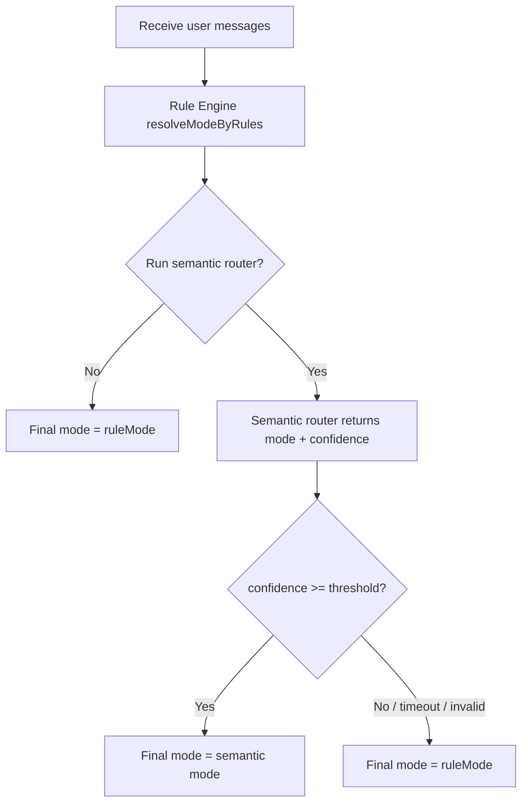

# Chat Mode Logic One-Pager (v2)

目的：用一頁講清楚 `B / G1 / G2 / G3` 點判、先後次序、衝突時點處理，方便開發、QA、姑娘同一口徑驗收。

## 1) 一眼睇明：判定流水線



一句總結：一定先做 Rules；Semantic 只係「有條件覆蓋」。

## 2) Rules 優先序（命中即 return）

> 下表由高到低；上面命中就唔再睇下面。

| 優先 | 條件 | 結果 mode | 說明 |
|---|---|---|---|
| 1 | `hasRecentBookingIntent && !explicitCancel` | `B` | 近期 user 對話仍在預約語境（只看最近 user turns） |
| 2 | `hasLatestBookingKeyword` | `B` | 最新一句明確有預約/改期/取消語意 |
| 3 | `hasLatestG2OptInReply` | `G2` | 用戶短答「好/要/可以」接住 assistant 深入邀請 |
| 4 | `latestLength > 150 || hasLatestG3Keyword` | `G3` | 長複雜敘述或深度困擾詞 |
| 5 | `hasLatestG2Keyword` | `G2` | 要求原理/詳細解釋 |
| 6 | else | `G1` | 一般健康短答 |

## 3) Keyword 與訊號來源

### Booking keywords
- `預約`, `約診`, `book`, `改期`, `取消預約`, `reschedule`, `cancel`, `邊日有空`, `幾時有得睇`

### G2 keywords
- `點解`, `原理`, `理論`, `詳細`, `解釋`, `explain`, `why`, `想知多啲`

### G3 keywords
- `困擾`, `一直`, `成日`, `唔知點算`, `幫我分析`, `教我`, `coach`

### 近期預約語境（已修正）
- `hasRecentBookingIntent` 只看最近 `RECENT_USER_INTENT_WINDOW=3` 個 user 訊息。
- 不再因為 assistant 自己提過「預約」就黏住 `B`。

## 4) 何時會跑 Semantic Router

Semantic 唔係每次跑，只有以下情況先跑：

| 條件 | 會否跑 semantic |
|---|---|
| 最新句有 booking keyword | 否（保持 deterministic） |
| 最新句有 explicit cancel | 否 |
| 屬 G2 opt-in reply | 否 |
| 有 recent booking intent（語境黏性） | 是 |
| 同時有 G2 + G3 訊號 | 是 |
| 長度介乎 120~220（邊界模糊） | 是 |

## 5) Semantic 覆蓋規則

- Router 輸出：`{ mode, confidence, reasons[] }`
- 只有 `confidence >= threshold`（預設 `0.75`）先覆蓋 rules 結果。
- 否則（低信心、timeout、JSON 失敗）全部 fallback 用 `ruleMode`。

## 6) 最終 mode 驗收題庫（20 題）

格式：`輸入 -> 預期 mode -> 命中理由`

1. `我想預約李醫師下星期三` -> `B` -> 最新句 booking keyword
2. `幫我改期去2月25號` -> `B` -> 最新句 booking keyword
3. `我想取消預約` -> `B` -> 最新句 booking keyword
4. `荃灣邊日有空位？` -> `B` -> 最新句 booking keyword
5. `book appointment with Dr Lee` -> `B` -> 最新句 booking keyword
6. `我可唔可以食茄子？` -> `G1` -> 無 booking/G2/G3 訊號
7. `感冒可唔可以飲凍嘢？` -> `G1` -> 一般短問答
8. `今日頭痛，應該點做？` -> `G1` -> 一般健康建議
9. `點解陰虛唔適合太辣？` -> `G2` -> G2 keyword
10. `可以詳細解釋下原理嗎？` -> `G2` -> G2 keyword
11. `why does this happen?` -> `G2` -> G2 keyword
12. `好`（上一輪 assistant 問「想唔想我詳細講原理？」） -> `G2` -> G2 opt-in
13. `我呢幾個月一直瞓唔好，成日心慌，唔知點算` -> `G3` -> G3 keyword
14. `幫我分析下點解每晚都焦慮` -> `G3` -> G3 keyword
15. 超長 180 字生活困擾描述 -> `G3` -> length > 150
16. `我想預約，同埋想知點解我頸痛` -> `B` -> B 優先序高於 G2
17. `下周`（前文連續 2 輪講預約） -> `B` 或 semantic 覆蓋 -> 先 rule=B，再視 confidence
18. `其實唔使預約住，想問飲食先` -> 通常 `G1/G2` -> cancel 訊號會打斷 B stickiness
19. `book... but explain why I keep neck pain` -> `B` -> booking 優先
20. `我一直困擾，但都想改期` -> `B` -> booking 優先

## 7) Debug 對照（實戰）

每次驗收請同時記錄：
- `ruleMode`
- `final mode`
- `source`（`rules` / `semantic` / `rules_fallback`）
- `routerConfidence`
- `routerError`（如 timeout / low confidence）

建議從 API log 對照 `Mode decision` 輸出。

## 8) 一行偽代碼（便於記憶）

```txt
ruleMode = rules(messages)
if shouldRunSemantic(ruleSignals):
  semantic = router(messages)
  finalMode = semantic.mode if semantic.confidence >= threshold else ruleMode
else:
  finalMode = ruleMode
```

## 9) 目前已落地修正（2026-02-18）

- 修正前：recent booking intent 會受 assistant 訊息影響，容易誤黏 `B`。
- 修正後：只看最近 user turns；assistant 主動提預約不再單獨造成 `B` 鎖定。
