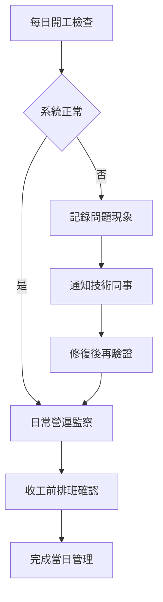

# Eden 系統說明書（管理者版）

## 1. 呢份文件係畀邊個
呢份係畀診所管理者、營運負責人、店長用。
目標係幫你用簡單方法，管理預約系統每日運作，減少漏單、撞期同病人投訴。

## 2. 系統做到咩
- 網站 Chatbot 幫病人查資料、問問題、做預約
- 系統會即時查 Google Calendar 空檔，避免重複時段
- 預約成功後會發確認電郵，電郵內有改期同取消連結
- 醫師可喺醫師控制台管理病人資料、護理指引、覆診計劃
- 系統有自動提醒（覆診前提醒電郵）同逾期覆診標記

## 3. 管理者每日要做嘅事（建議）
1. 早上開工先做快速檢查（5-10分鐘）
- 測試一次預約流程（至少去到可揀時段）
- 檢查有冇病人話收唔到確認電郵
- 檢查 Google Calendar 有冇明顯撞期

2. 日間營運檢查
- 留意姑娘回報：有冇「查唔到時段」或「改期失敗」
- 留意醫師回報：病人資料或覆診狀態有冇異常

3. 收工前檢查
- 確認第二日門診排班同人手一致
- 確認重大改動（排班、假期）已通知前線

## 4. 權限同資料管理（重點）
- 醫師/姑娘屬於 staff，權限由 `staff_roles` 管
- 醫師或姑娘可見邊位病人，由 `patient_care_team` 決定
- 要避免「睇錯病人資料」，一定要定期檢查 care team 關聯

簡單原則：
- 新同事入職：先開 staff role，再分配病人關聯
- 同事離職或轉組：即時停用角色或移除關聯

## 5. 排班同假期管理（管理者要知道）
目前系統排班有兩層：
1. 先讀資料庫排班（`doctor_schedules`）
2. 如果資料庫讀唔到，會退回程式內建排班（`shared/schedule-config.ts`）

假期阻擋由 `holidays` 控制，可設：
- 全診所假期
- 指定醫師假期
- 指定分店假期

管理者角度建議：
- 所有排班/假期改動，落實前先同技術同事同步
- 大改排班（例如醫師改駐診日）最少提早 1-2 日更新

## 6. 自動化功能（你要知道有冇跑）
系統有兩個定時工作：
- 預約提醒：每小時執行一次（提早約 24 小時寄提醒電郵）
- 覆診逾期：每日執行一次（將過咗建議日期但未處理嘅計劃標記為 `overdue`）

如果前線話「提醒冇出」：
- 先查該預約是否有病人電郵
- 再叫技術同事檢查 cron 同環境變數

## 7. 常見問題處理指引
### 情況 A：病人話預約咗但收唔到電郵
1. 先查預約是否成功入咗 Google Calendar
2. 確認病人填寫電郵有冇錯
3. 檢查垃圾郵件
4. 如持續發生，交技術同事檢查 Gmail 設定

### 情況 B：病人話見到時段但落單失敗
1. 先解釋可能係「最後一步撞單」
2. 請病人或姑娘重新揀另一個時段
3. 如大量發生，交技術同事檢查 API 錯誤紀錄

### 情況 C：醫師話見唔到病人
1. 檢查該醫師係咪 active staff
2. 檢查 `patient_care_team` 有冇建立關聯

## 8. 管理者流程圖

## 9. 管理者一句總結
你最重要係三件事：
- 權限分配啱
- 排班資料準
- 問題回報快

做到呢三樣，系統就會穩定，前線壓力會低好多。
