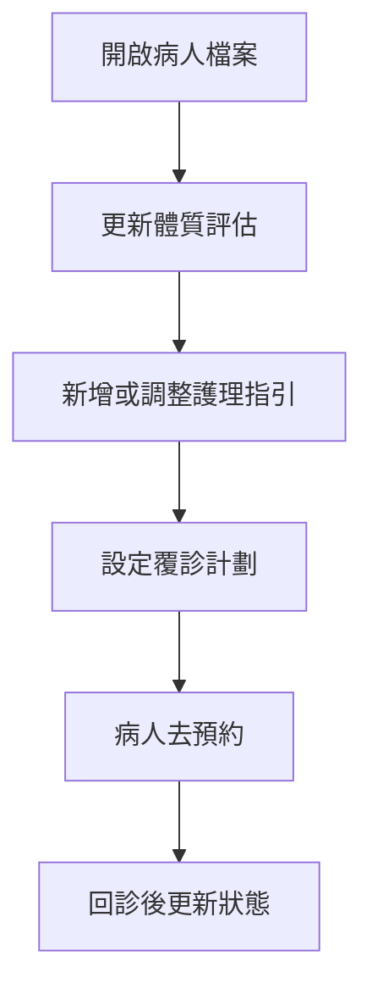

# Eden 系統說明書（中醫師版）

## 1. 呢份文件畀邊個
畀醫師使用醫師控制台時參考。
重點係：快、準、易跟進。

## 2. 醫師日常會用到咩
- 病人列表（可搜尋）
- 病人體質評估（可更新）
- 護理指引（可新增/編輯）
- 覆診計劃（可新增/改狀態）
- 操作紀錄（Audit Log）

## 3. 登入同進入控制台
1. 用 Google 帳號登入
2. 進入醫師控制台
3. 先喺病人列表搜尋病人

如果入唔到控制台：
- 通常係帳號未有 staff 權限
- 請通知管理者或技術同事處理

## 4. 病人頁面點用
病人頁分四大區：

### A. 體質評估
- 更新體質分類（例如虛損、鬱結、痰濕等）
- 可加備註（例如近期觀察重點）
- 儲存後，病人 AI 對話會用到你最新資料

### B. 護理指引
- 可新增飲食、生活、警示類指引
- 可設定開始/結束日期
- 可改狀態（生效中、暫停、完成）

### C. 覆診計劃
- 可新增建議覆診日期同原因
- 狀態常見有：
  - `pending`：待覆診
  - `booked`：已預約
  - `done`：已完成
  - `overdue`：逾期
  - `cancelled`：已取消

### D. 操作紀錄（Audit Log）
- 可見邊個改過資料、幾時改、改咗乜
- 用嚟追蹤歷史，避免溝通誤會

## 5. 建議工作流程（每位病人）
1. 睇診前：先睇上次體質同指引
2. 睇診後：即場更新體質 + 備註
3. 加入本次護理指引（盡量清晰、可執行）
4. 設定覆診日期同原因
5. 必要時即場叫病人預約下一次

## 6. 寫指引小技巧（病人更易跟到）
- 句子短啲，重點一行一點
- 用「可做 / 避免」方式寫
- 避免太多專業術語

例子：
- 可做：晚飯後散步 15-20 分鐘
- 避免：晚上 11 點後先瞓

## 7. 常見問題
### 問：更新完資料，病人話 AI 仲未見到？
- 通常重新開對話或稍後再問就會帶到新資料
- 如長時間都唔更新，通知技術同事檢查

### 問：點解我睇唔到某位病人？
- 多數係未建立你同病人嘅 care team 關聯

## 8. 醫師流程圖

## 9. 醫師一句總結
你每次更新得清楚，病人 AI 建議就會更貼身，覆診率都會更穩定。
