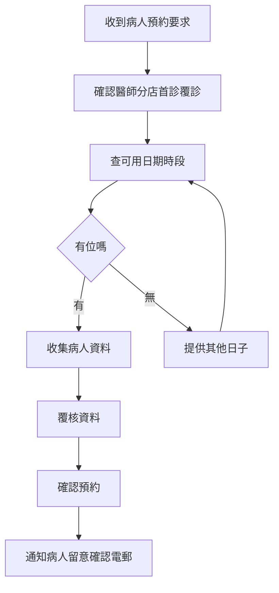

# Eden 系統說明書（姑娘排單版）

## 1. 呢份文件畀邊個
畀負責接電話、WhatsApp、排期嘅姑娘。
目標係：快手幫病人落單，減少錯資料。

## 2. 你會用到嘅功能
- 查可預約時段
- 代病人建立預約
- 協助病人改期/取消
- 收到諮詢表後回覆病人

## 3. 代病人排單標準流程
1. 先問清楚：
- 想睇邊位醫師
- 想去邊間分店
- 首診定覆診

2. 入系統揀日期同時段
- 系統會自動顯示可預約時間
- 如果當日滿咗，叫病人改揀另一日

3. 輸入病人基本資料
- 姓、名、電話、電郵
- 是否要收據
- 取藥方式

4. 如果係首診，仲要補充：
- 身份證
- 出生日期
- 性別
- 敏感史
- 正服用藥物
- 主要症狀
- 認識診所渠道

5. 最後同病人覆核一次資料，再確認預約

## 4. 改期同取消
### 改期
- 最簡單做法：叫病人打開確認電郵入面嘅改期連結
- 入去後可重新揀日期時段，確認即完成

### 取消
- 同樣由電郵取消連結處理最快
- 取消後該時段會釋放返

如果病人話搵唔到電郵：
- 先幫病人確認電郵地址
- 再由姑娘轉用人工方式處理（例如直接聯絡診所再安排）

## 5. 排單時要特別小心
- 電話號碼同電郵要對清楚
- 醫師/分店唔好揀錯
- 首診資料要齊，否則容易覆診前再追資料
- 確認預約前一定讀一次重點（醫師、日期、時間、分店）

## 6. 常見情況快速處理
### 情況 A：病人想要即日
- 系統有一小時安全緩衝，太近時間可能唔畀落單
- 建議病人揀下一個可用時段

### 情況 B：病人話改期失敗
- 先試刷新頁面再揀一次
- 如果仍失敗，交管理者或技術同事跟進

### 情況 C：病人冇電郵
- 仍可代為預約
- 但病人收唔到自助改期/取消連結，要靠姑娘跟進

## 7. 姑娘排單流程圖

## 8. 姑娘一句總結
排單最緊要係「問清楚、入準確、覆核一次」，咁就可以大幅減少改單同投訴。
