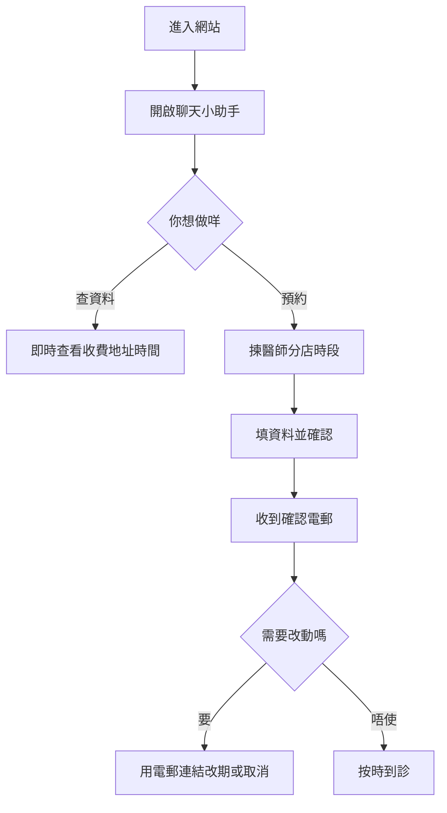

# Eden 系統說明書（病人版）

## 1. 呢個系統可以幫你做咩
- 查診所資料（地址、營業時間、收費）
- 查醫師時間表
- 網上預約
- 收到確認電郵
- 用電郵連結自行改期或取消
- 登入後使用 AI 體質諮詢

## 2. 點開始用
### 方法 A：網站右下角小助手
1. 打開診所網站
2. 撳右下角聊天按鈕
3. 按指示揀功能

### 方法 B：AI 體質諮詢頁
1. 用 Google 帳號登入
2. 進入 AI 諮詢頁
3. 直接輸入問題

## 3. 預約步驟（簡單版）
1. 揀醫師
2. 揀診所
3. 揀首診/覆診
4. 揀日期同時間
5. 填基本資料（姓名、電話、電郵等）
6. 確認資料後提交

成功後你會見到預約編號，亦會收到確認電郵。

## 4. 改期或取消
- 打開確認電郵
- 撳「改期」或「取消」連結
- 跟頁面步驟完成

提醒：
- 越早改期越容易有理想時段
- 取消後原本時段會釋放俾其他病人

## 5. AI 諮詢係點運作
- 系統會用廣東話回答
- 登入後，系統可根據你已有照護資料提供更貼身建議
- AI 主要提供健康資訊同調理建議，唔會取代正式診症

## 6. 常見問題
### 問：點解我見到時段但最後預約唔到？
答：可能同一時間有其他人先一步提交，請改揀另一個時段。

### 問：我收唔到確認電郵點算？
答：先檢查垃圾郵件，再確認你填寫嘅電郵地址有冇錯。

### 問：我可唔可以唔登入都用到？
答：一般查資料同預約可以；AI 個人化功能建議登入後使用。

## 7. 病人使用流程圖

## 8. 病人一句總結
你只要跟住系統一步步揀，就可以完成預約；有改動就用電郵連結處理，最快最穩陣。
