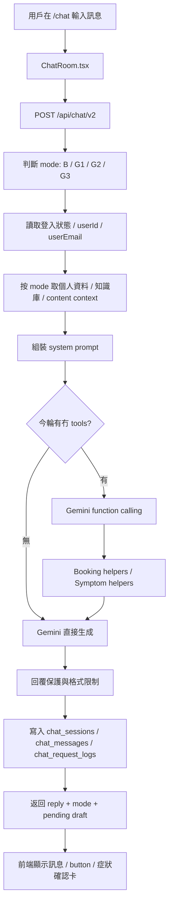

# AI 對話系統完整邏輯總結
## 最後更新：2026-03-19

> 呢份文件係俾姑娘、管理者、Owner 同之後幫手改系統的人睇。
> 目標係用一份 Markdown，講清楚「而家 AI 對話系統實際點運作」、「每一步去邊度改」、「咩位係 code 控制、咩位係資料表控制」。
> 
> 呢份文件以現時 `EdenChatbotBooking/` 內真正生產主線為準。

---

## 0. 先講最重要結論

而家系統其實有兩套聊天邏輯同時存在：

### A. 新主線聊天頁
- 前端入口：`app/chat/page.tsx`
- 主聊天室：`components/chat-v2/ChatRoom.tsx`
- 後端主腦：`app/api/chat/v2/route.ts`
- 呢套先係現時「多輪對話 + 自動模式切換 + 預約 function call + 症狀記錄」主系統

### B. 舊 widget / 舊嵌入聊天
- 元件：`components/ChatWidget.tsx`
- API：`app/api/chat/route.ts`
- 呢套仲存在，但係邏輯明顯較舊，唔係 v2 呢份文件講嘅主流程

### 所以如果要改「而家 AI 對話系統」
- 主要應該改 `app/api/chat/v2/route.ts`
- 如果改完發現網站某個舊 chatbot 無變，就要檢查嗰個頁面其實係咪仲用緊 `/api/chat`

---

## 1. 整個系統流程圖



---

## 2. 前端實際點運作

主檔案：`components/chat-v2/ChatRoom.tsx`

### 2.1 開新對話時會做咩
- 自動生成 `sessionId`
- 畫面先放一條歡迎訊息
- 初始 mode 當作 `G1`
- 如果用戶已登入，可以之後讀返歷史對話

### 2.2 每次送出訊息時
- 前端會把整段 `messages[]` 連同 `sessionId` 一齊 POST 去 `/api/chat/v2`
- 後端唔係只睇最新一句，而係會睇整段對話
- 回來後前端會更新：
  - assistant reply
  - mode badge
  - optional `callToAction`
  - optional `pendingSymptomDraft`

### 2.3 對話歷史
- 已登入用戶可打開 history drawer
- 資料來源係 Supabase `chat_messages`
- 開返舊對話時，前端會把該 `session_id` 全部訊息載入
- mode 會以最後一條 assistant message 的 mode 為準

### 2.4 症狀確認卡
- 如果後端回傳 `pendingSymptomDraft`
- 前端會顯示一張「待確認症狀卡」
- 用戶可以：
  - 確認儲存
  - 取消
  - 手動改 category / severity / startedAt / endedAt / description
- 真正入庫唔係在主聊天 API 發生，而係按確認後 POST 去 `app/api/chat/v2/confirm-symptom/route.ts`

### 2.5 助手訊息可附帶動作按鈕
- 現時主要係 booking fast path 會附帶 `立即預約` 按鈕
- 按鈕資料來自後端 `callToAction`

---

## 3. 後端主流程實際順序

主檔案：`app/api/chat/v2/route.ts`

每次收到訊息，實際步驟係：

1. 驗證 request body
2. 找出最新一條 user message
3. 初始化 Gemini model
4. 先做 mode 判斷
5. 讀取登入 user / email / constitution / care context
6. 如有需要，讀取 content reference context
7. 組裝 system prompt
8. 根據 mode 決定有冇 function tools
9. 如果命中特快路徑，直接回覆
10. 否則 call Gemini
11. 如果 Gemini 要 function call，就執行 helper，再餵結果返 Gemini
12. 對 reply 做保護、縮短、格式限制
13. 寫 log
14. 回傳 reply、mode、draft、action

---

## 4. Mode 點判斷

系統只有四個 mode：

| Mode | 意思 | 主要用途 |
|---|---|---|
| `B` | Booking | 預約、改期、取消、查預約 |
| `G1` | General 1 | 短答、一般健康問答 |
| `G2` | General 2 | 原理、解釋、較詳細說明 |
| `G3` | General 3 | 深入分析、教練式引導、長複雜困擾 |

### 4.1 Rule-based 初判

先跑 `resolveModeByRules(messages)`。

判斷順序係：

1. 如果最新訊息屬於「格式任務」
   - 例如改寫、總結、bullet、JSON
   - 就算前文提過 booking，都可拉回 `G1`

2. 如果係短短地的 booking 跟進句
   - 例如「下周」、「明天」、「10:00」、「好」
   - 而上一句 assistant 又明顯係 booking 進度句
   - 直接留在 `B`

3. 如果最近幾輪 user 訊息仍然係 booking 語境，而且冇明確取消
   - 保持 `B`

4. 如果最新句本身有 booking keyword
   - 入 `B`

5. 如果最新句係「想再聽詳細啲」呢類短確認
   - 入 `G2`

6. 如果字數長，或者有深層困擾關鍵字
   - 入 `G3`

7. 如果有原理、解釋、詳細等字眼
   - 入 `G2`

8. 其他全部當 `G1`

### 4.2 重要關鍵字

`B` 常見觸發字：
- 預約
- 約診
- book
- booking
- appointment
- 改期
- cancel
- 幾時有得睇

`G2` 常見觸發字：
- 點解
- 原理
- 詳細
- 解釋
- why
- explain

`G3` 常見觸發字：
- 困擾
- 一直
- 成日
- 唔知點算
- 幫我分析
- coach

退出 booking 黏性常見字：
- 不用
- 唔使
- 取消
- 算了
- 改日
- 唔約

### 4.3 Semantic Router 只係補刀，不係主判官

如果規則判得唔夠清晰，系統先會 call 一次 Gemini 做 semantic router。

只會在以下情況容易觸發：
- G2 同 G3 訊號重疊
- 最近似乎仲係 booking，但最新句唔清楚
- 訊息長度落在邊界區間

Semantic router 會輸出：

```json
{"mode":"B|G1|G2|G3","confidence":0.0,"reasons":["..."]}
```

只有當 confidence 高過門檻，先會覆蓋 rule result。

### 4.4 一句白話總結

- booking 相關內容，系統偏向保守，寧願留在 `B`
- 非 booking 的長篇深入問題，偏向 `G3`
- 問「點解／原理」通常會去 `G2`
- 普通短問答就 `G1`

---

## 5. 每個 Mode 真正會發生咩事

## 5.1 B mode

用途：
- 查醫師
- 查診所
- 查日期時段
- 建立預約
- 查自己預約
- 改期 / 取消的引導

特性：
- 讀 code 內建 booking prompt
- 不讀 Supabase `chat_prompt_settings`
- 不讀 `knowledge_docs`
- 預設短答
- 只開 booking tools
- 明確禁止扮成功落單

## 5.2 G1 mode

用途：
- 一般短問答
- 快速可執行建議
- 偏保守、唔長篇

特性：
- 會讀體質與個人資料
- 會讀內容知識庫
- 會套 output guard
- 已登入時可開 symptom tools

## 5.3 G2 mode

用途：
- 解釋原因
- 講原理
- 比 G1 更深入，但唔係心理教練式長談

特性：
- 會加一段額外 G2 guidance
- 要先講 general 健康角度，再講體質，再問一條澄清問題
- 對 booking 引流有低頻限制，唔可以密密推去預約

## 5.4 G3 mode

用途：
- 長篇困擾
- 深入拆解
- 教練式引導

特性：
- 知識與語境注入最多
- 可以比較深入理解用戶狀況
- 但仍受全局輸出規則限制

---

## 6. Prompt 係點組裝

### 6.1 B mode prompt 來源

由 `buildBookingSystemPrompt()` 建立。

內容主要由 code 直接決定，包括：
- booking assistant 身份
- 只可處理預約內容
- 必須用 functions
- 必須問齊欄位
- 取消/改期要先導去確認信連結
- 診所資料、WhatsApp、醫師固定應診資訊

所以如果想改 booking 對話節奏、語氣、欄位要求、禁語，主要係改 code。

### 6.2 G1/G2/G3 prompt 來源

優先順序係：

1. 先看 Supabase `chat_prompt_settings`
2. 再取 `knowledge_docs`
3. 再加 care context
4. 再加 content reference context
5. 再補診所資訊、醫師資訊、WhatsApp

如果資料表搵唔到 active prompt，先 fallback 去 code 內 `buildFallbackPrompt()`

### 6.3 G 模式會額外加咩

- `G2` 會加一段 `buildG2ConversationGuidance()`
- 已登入且非 `B`，會加 `SYMPTOM_RECORDING_GUIDANCE`
- 如果用戶要求 article / source / link，會加內容連結專用規則
- 全 mode 最後都會加 `OUTPUT_FORMAT_RULES`

### 6.4 日期 guardrail

Prompt 裏會明示：
- 今天係香港時間邊一日
- 如果用戶講「今日 / 而家 / today」
- 症狀日期要轉成實際 `YYYY-MM-DD`

---

## 7. 知識庫同個人化資料點注入

### 7.1 constitution 來源

來自：
- `patient_care_profile.constitution`

可為：
- `depleting`
- `crossing`
- `hoarding`
- `mixed`
- `unknown`

### 7.2 care context 來源

`fetchCareContext()` 會讀：
- `patient_care_profile`
- `care_instructions`
- `follow_up_plans`
- `symptom_logs`

會把以下資料串成 prompt：
- 體質
- 體質備註
- 醫師照護指示
- 下次跟進日期
- 近期症狀記錄

### 7.3 content context

由 `buildContentReferenceContext()` 根據最新問題找站內內容。

用途：
- 用戶問某個健康主題時，補充站內文章上下文
- G1 有較嚴格的 context budget，避免 prompt 太長

### 7.4 knowledge_docs 選文規則

`knowledge_docs` 唔係每次全部塞進去，而係：
- 先按用戶最新問題抽關鍵詞
- 再為每篇文打分
- 按 mode 只取 top K
- 再受字數上限限制

目前大概上限：

| Mode | Top K | Max chars |
|---|---|---|
| `G1` | 3 | 1200 |
| `G2` | 4 | 1800 |
| `G3` | 5 | 2200 |

---

## 8. Booking 對話實際步驟

核心檔案：
- `app/api/chat/v2/route.ts`
- `lib/booking-conversation-helpers.ts`

可用 tools 只有三個：
- `get_booking_options`
- `list_my_bookings`
- `create_booking`

### 8.1 查可預約醫師 / 診所 / 時段

模型應該先 call：
- `get_booking_options`

可以一次帶入：
- `doctorNameZh`
- `date`
- `clinicNameZh`

function 會回：
- `missingFields`
- `nextQuestion`
- `availableSlots`
- `clinics`

白話理解：
- 唔齊資料，function 直接話你知下一條應該問乜
- 齊晒資料，就回可用時段

### 8.2 booking context 自動補位

如果用戶只講：
- 「李醫師」
- 「下星期三」
- 「荃灣」

系統會透過 `extractBookingConversationContext()` 從最近對話抽返：
- 醫師
- 診所
- 日期

亦會處理：
- `2026-03-25`
- `3月25號`
- `下星期三`
- `tomorrow`
- `today`

### 8.3 booking fast path

為咗減少延遲，B mode 有幾條快路：

#### 直接預約 CTA
如果最新句已經好明確想預約：
- 後端可直接回一句短答
- 再附 `立即預約` button

#### 短 booking 跟進 fast path
例如用戶只答：
- 下周
- 明天
- 10:00
- 好

系統可唔經完整 LLM 長回覆，直接用 deterministic 邏輯答返下一步。

#### 改期 / 查預約 fast path
如果用戶問：
- 我有咩預約
- 我要改期
- 我要取消

系統會優先查 `listMyBookings()`，再直接回覆確認句。

### 8.4 真正建立預約

建立預約唔係一句 prompt 做到，而係 `createConversationalBooking()` 做完整流程：

1. 驗證欄位
2. 正規化醫師名 / 診所名
3. 驗證醫師與診所 mapping
4. 再查一次 calendar availability
   - 防 double booking
5. 先建立 `booking_intake` pending 記錄
6. 再寫入 Google Calendar event
7. 再把 intake 標記 confirmed，並連結 event id
8. 同步病人 profile 聯絡資料
9. best effort 發確認 email

### 8.5 Booking 必問欄位

預設必問：
- 姓名
- 電話
- 首診 / 覆診
- 收據需求
- 取藥方法
- email

但如果用戶已登入，而且後端已有 `userEmail`：
- prompt 會明確寫「唔好再問 email」
- create_booking 時亦會自動 inject email

如果係首診，仲要額外問：
- idCard
- dob
- gender
- allergies
- medications
- symptoms
- referralSource

### 8.6 改期 / 取消唔係直接喺 chat 完成

現時 B mode 對改期 / 取消的主邏輯係：
- 先查到你最近預約
- 再請你確認係咪處理呢一個 booking
- 真正取消 / 改期主要仍然引導去 email 裏的 link
- 如果搵唔到信或者 link 有問題，先轉姑娘 / WhatsApp

即係話：
- chat v2 會幫你定位 booking
- 但唔係全面對話內改期 UI

---

## 9. Symptom 對話實際步驟

核心檔案：
- `lib/symptom-conversation-helpers.ts`
- `app/api/chat/v2/confirm-symptom/route.ts`

### 9.1 只有已登入用戶先有症狀功能

條件：
- `mode !== 'B'`
- `userId` 存在

否則唔會開 symptom tools。

### 9.2 三個 symptom tools

- `log_symptom`
- `update_symptom`
- `list_my_symptoms`

### 9.3 重要設計：log_symptom 唔會即時入庫

當用戶講：
- 我今日頭痛
- 我最近失眠
- 我 3 月 1 號開始經痛

AI 會先 call `log_symptom` 類型的草稿邏輯，但實際在 v2 主流程中，後端只會建立 `pendingSymptomDraft` 回前端。

真正正式儲存要：
1. 前端收到草稿
2. 顯示確認卡
3. 用戶按確認
4. 前端 POST 到 `/api/chat/v2/confirm-symptom`
5. confirm API 再 call `logSymptom()` 真正寫入 `symptom_logs`

### 9.4 update_symptom

當用戶講：
- 我頭痛好返
- 經期完咗
- 呢個症狀已經冇事

AI 可 call `update_symptom`

可更新：
- `status`
- `endedAt`
- `resolutionMethod`
- `resolutionNote`
- `resolutionDays`

### 9.5 list_my_symptoms

當用戶問：
- 我之前有咩症狀
- 我上次頭痛係幾時

AI 可 call `list_my_symptoms`

### 9.6 症狀資料驗證

helper 內有嚴格驗證：
- 日期必須 `YYYY-MM-DD`
- `endedAt` 唔可早過 `startedAt`
- severity 1-5
- resolved 類資料只可以配合 endedAt / resolved status

---

## 10. Output guard 同回覆保護

呢部分好重要，因為好多「AI 怪回覆」其實唔係 prompt 本身，而係最後 guard 再收口。

### 10.1 全局格式規則

`OUTPUT_FORMAT_RULES` 會限制：
- 禁止用 markdown 星號
- 禁止透露內部 mode 名稱
- 禁止輸出機械式「引用：」
- 診所電話要配 WhatsApp URL
- 診所地址要配 Google Maps URL
- 禁止提供煮食做法

### 10.2 Output contract

如果用戶本輪要求：
- 用 JSON
- 用幾點 bullet
- 限幾多字
- 做 summary / rewrite

系統會偵測 `detectOutputContract()`，再對答案強制做：
- JSON 化
- bullet 化
- 字數裁切

### 10.3 B mode 短答封頂

`applyBResponseTemplateCap()` 會把 booking reply 壓短

目標：
- 避免 booking 回覆太長
- 避免一次過講太多診所資訊

### 10.4 Booking completion guard

呢個 guard 專門防止 AI「吹水式成功」。

如果 AI 回覆聲稱：
- 預約成功
- 已幫你完成
- 已登記

但其實 `create_booking` 冇成功執行：
- 系統會把 reply 改寫成一條明確補救訊息
- 提醒其實未落單成功
- 要求補資料或重試

### 10.5 Pending symptom reply guard

如果本輪有 `pendingSymptomDraft`
- reply 會被補上：
  - 呢個只係草稿
  - 要按確認先正式儲存
  - 之後會保留俾醫師參考

---

## 11. LLM 何時用 tools，何時唔用

### 11.1 Booking
- mode = `B`
- 只開 booking tools
- 唔開 symptom tools

### 11.2 G mode + 已登入
- 開 symptom tools

### 11.3 G mode + 未登入
- 唔開 tools

### 11.4 非工具任務可繞過 tools

例如：
- 改寫
- summary
- JSON 輸出

如果系統判斷今輪其實係 formatting task
- 即使已登入，都可以唔開 tools，直接生成

---

## 12. Streaming 與 non-streaming

### 12.1 會 streaming 的情況
- 用戶要求 stream
- 功能 flag 開啟
- 今輪冇 tools
- 今輪唔要求 strict JSON

### 12.2 唔會 streaming 的情況
- 有 function calling
- 有 output contract 需要嚴格收口
- booking / symptom tools 要穩定執行

所以實際上：
- booking 幾乎都係 non-stream
- function calling 幾乎都係 non-stream
- 普通純聊天先較常 streaming

---

## 13. 資料庫與 log

### 13.1 對話歷史

會寫入：
- `chat_sessions`
- `chat_messages`
- `chat_request_logs`

### 13.2 `chat_messages` 寫咩
- 每輪 user message
- 每輪 assistant message
- 會記住 `mode`
- 前端 history drawer 就係由呢度讀

### 13.3 `chat_request_logs` 寫咩
- mode
- tokens
- duration
- knowledge stats
- semantic router metadata
- function call rounds

### 13.4 booking 相關資料

會寫入：
- `booking_intake`
- Google Calendar

### 13.5 symptom 相關資料

會寫入：
- `symptom_logs`
- `audit_logs`

---

## 14. 如果姑娘們想改，應該去邊度改

### 14.1 想改 AI 語氣、答法、長短

先分清係邊個 mode：

#### G1 / G2 / G3
- 優先改 Supabase `chat_prompt_settings`
- 必要時改 `buildFallbackPrompt()`
- G2 特有規則改 `buildG2ConversationGuidance()`

#### B
- 直接改 `FALLBACK_MODE_PROMPTS.B`
- 改 `buildBookingSystemPrompt()`
- 改 `buildBModeBrevityGuidance()`

### 14.2 想改模式切換準則

改：
- `BOOKING_KEYWORDS`
- `CANCEL_KEYWORDS`
- `G2_KEYWORDS`
- `G3_KEYWORDS`
- `resolveModeByRules()`
- `shouldRunSemanticModeRouter()`

### 14.3 想改 booking 欄位 / 順序 / 流程

改：
- `FALLBACK_MODE_PROMPTS.B`
- `BOOKING_FUNCTIONS`
- `handleFunctionCall()`
- `lib/booking-conversation-helpers.ts`

### 14.4 想改可預約時段邏輯

改：
- `getAvailableTimeSlots()`
- schedule mapping / calendar mapping 相關資料源

### 14.5 想改「查自己預約」邏輯

改：
- `listMyBookings()`

### 14.6 想改症狀記錄欄位 / 規則

改：
- `SYMPTOM_FUNCTIONS`
- `SYMPTOM_RECORDING_GUIDANCE`
- `buildPendingSymptomDraft` 相關邏輯
- `lib/symptom-conversation-helpers.ts`
- `app/api/chat/v2/confirm-symptom/route.ts`

### 14.7 想改知識庫內容

改 Supabase：
- `knowledge_docs`

### 14.8 想改 G 模式 prompt 模板

改 Supabase：
- `chat_prompt_settings`

### 14.9 想改前端顯示方式

改：
- `components/chat-v2/ChatRoom.tsx`
- `components/chat-v2/MessageList.tsx`
- `components/chat-v2/ModeSelector.tsx`

### 14.10 想改舊 widget

改：
- `components/ChatWidget.tsx`
- `app/api/chat/route.ts`

但要知道：
- 呢套唔係 v2 主系統
- 同 `/chat` 新頁唔共用全部邏輯

---

## 15. 姑娘們最應該知道的「真實規矩」

### 規矩 1
「而家 AI 會自動轉 mode，唔使手動切模式。」

### 規矩 2
「預約模式唔係讀知識庫，而係讀 code 寫死嘅 booking prompt。」

### 規矩 3
「健康模式大多數內容可以用 Supabase prompt 同 knowledge docs 微調。」

### 規矩 4
「症狀記錄第一步只係草稿，病人按確認先真入庫。」

### 規矩 5
「AI 唔應該自己扮已經幫人成功預約；系統有 guard 防呢樣。」

### 規矩 6
「如果改完 `/api/chat/v2` 但 widget 無變，代表 widget 仲用緊舊 `/api/chat`。」

---

## 16. 建議姑娘們之後點樣提出修改需求

最有效嘅講法唔係：
- 「幫我改好個 AI」

而係：

### 語氣類
- 「G1 太長，請改做最多 3 句」
- 「B mode 一次問太多，改成每次只問 1 條」

### 路由類
- 「用戶講『我有咩預約』時一定要入 B」
- 「用戶講『其實唔使預約，想問飲食』時要盡快離開 B」

### booking 類
- 「首診 email 想改成非必填」
- 「改期時先顯示最近一個預約，再問是否確認」

### symptom 類
- 「症狀草稿想加『發作頻率』欄位」
- 「病人話『好返咗』時，自動補今天日期」

### knowledge 類
- 「G2 關於失眠想優先引用某篇文章」
- 「屯積型飲食建議要改得更保守」

---

## 17. 最後總結

如果用一句話講晒：

現時 AI 對話系統係一個「後端自動判 mode 的多輪聊天引擎」，其中：
- `B` 係 code-driven booking assistant
- `G1/G2/G3` 係 DB-driven 健康顧問
- 已登入時會加個人照護資料
- 非 booking 可帶症狀記錄功能
- 前端只負責顯示、history、症狀草稿確認

所以之後任何改動，第一步都應該先問自己：

1. 這個需求屬於 `B` 定 `G`？
2. 這是改 prompt、改 keyword、改 helper，定改前端顯示？
3. 這個頁面用的是 `/api/chat/v2` 還是舊 `/api/chat`？

答到呢三條，通常已經知道要改邊度。
